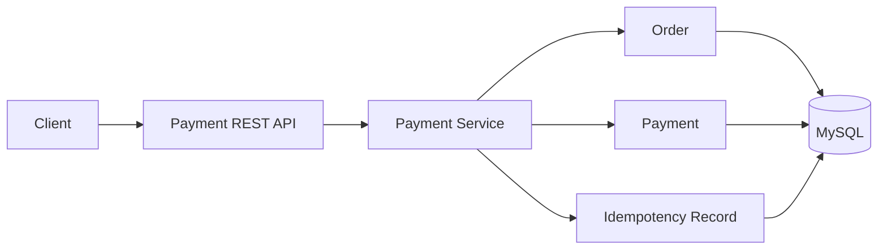
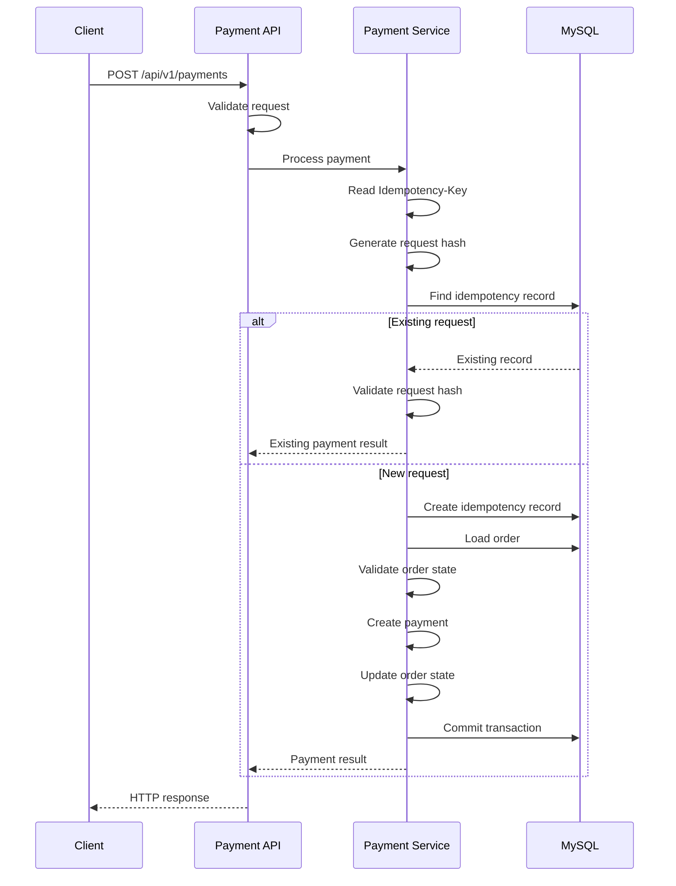
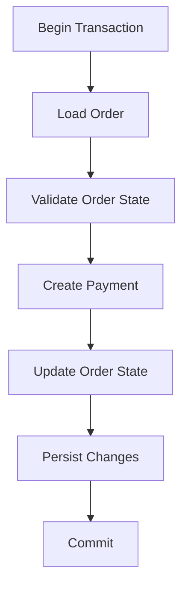
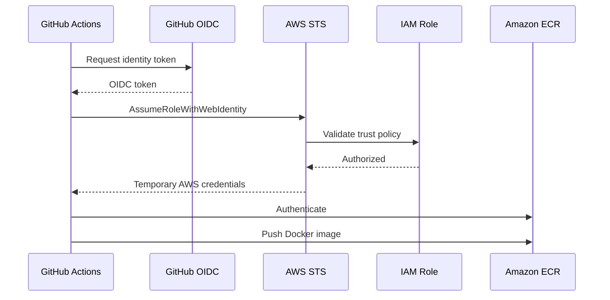
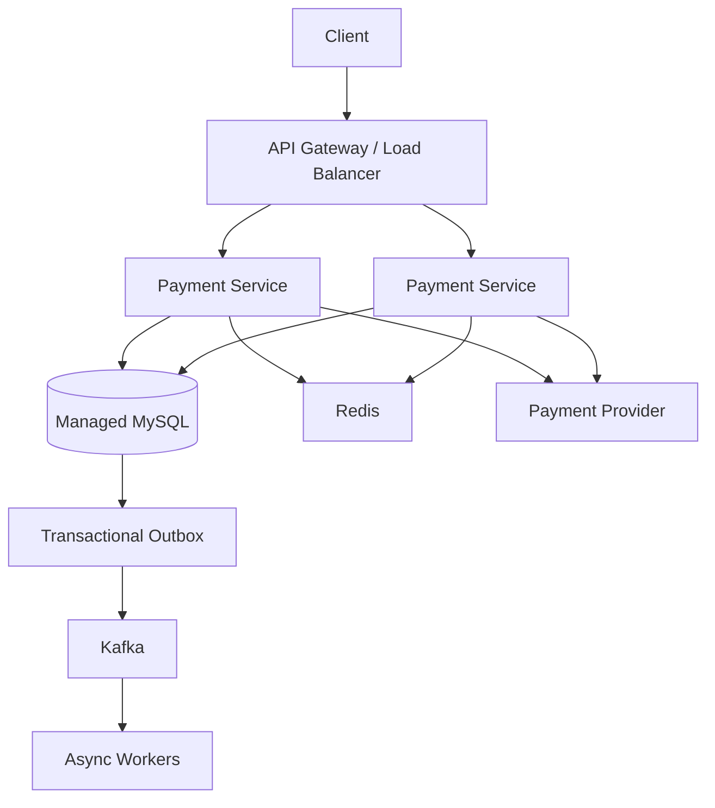

# Payment Gateway

A production-oriented payment processing backend built with Java 17 and Spring Boot, focused on idempotency, transactional consistency, domain state management, containerization, and AWS-based CI/CD.

This project is designed to explore the engineering problems that appear in real payment systems rather than implementing a simple CRUD payment API.

---

## Overview

Payment systems have a deceptively difficult problem:

> A payment request must produce a correct result even when clients retry requests, requests arrive concurrently, failures occur midway through processing, or the same operation is submitted multiple times.

This project addresses those concerns through:

- Idempotency keys
- Request payload hashing
- Database-backed idempotency records
- Transactional business operations
- Explicit order and payment states
- Database uniqueness constraints
- REST API design
- Containerized execution
- Automated CI
- AWS ECR image publishing
- GitHub Actions OIDC authentication
- IAM-based access control

The implementation is intentionally built around correctness and clear domain boundaries before introducing distributed infrastructure.

---

## Engineering Focus

| Area | Implementation |
|---|---|
| Backend | Java 17, Spring Boot |
| API | REST |
| Persistence | MySQL |
| ORM | Spring Data JPA / Hibernate |
| Transactions | Spring `@Transactional` |
| Idempotency | Database-backed idempotency records |
| Request validation | Application-level validation |
| Containerization | Docker |
| CI/CD | GitHub Actions |
| Container Registry | Amazon ECR |
| AWS Authentication | GitHub Actions OIDC |
| IAM | Least-privilege ECR role |
| Build | Maven |
| Testing | JUnit / Spring Boot Test |

---

# Architecture

## Current Architecture



The application follows a layered architecture:

```text
HTTP Layer
    ↓
Controller
    ↓
Service
    ↓
Repository
    ↓
MySQL
```

Business rules remain inside the service/domain layer rather than being coupled to HTTP or persistence concerns.

---

# Payment Processing Flow

A payment request follows a controlled lifecycle.



The important design principle is that retries should not accidentally create multiple payments for the same logical request.

---

# Idempotency

Idempotency is one of the core design concerns of the project.

A client may retry a payment request because of:

- Network timeout
- Connection interruption
- Client-side retry
- Load balancer timeout
- Temporary service failure

Without idempotency, the same logical payment request could potentially create multiple payment records.

## Request Model

The client provides an idempotency key:

```http
POST /api/v1/payments
Idempotency-Key: 7f6b4a9e-...
Content-Type: application/json
```

The service derives a hash from the request payload.

The system therefore evaluates the combination of:

```text
Idempotency-Key
        +
Request Hash
```

---

## Idempotency Decision Model

| Situation | Expected behavior |
|---|---|
| New key | Process request |
| Existing key + same request | Return existing result |
| Existing key + different request | Reject request |
| Concurrent attempt | Database consistency protects the idempotency record |

This prevents a client from accidentally reusing an idempotency key for a different payment request.

---

# Why Request Hashing?

An idempotency key alone is not enough.

Consider:

```text
Request A

Idempotency-Key: ABC123
Amount: ₹500
```

Later:

```text
Request B

Idempotency-Key: ABC123
Amount: ₹5000
```

If the application only checks the key, it could incorrectly treat the second request as the first request.

The request hash allows the service to verify that the same idempotency key represents the same logical operation.

---

# Database-Level Idempotency Guarantee

The idempotency key is protected by a database uniqueness constraint.

Conceptually:

```text
idempotency_records

idempotency_key
       │
       └── UNIQUE
```

An application-level check alone is vulnerable to a race condition:

```text
SELECT
   ↓
if not exists
   ↓
INSERT
```

Two requests can execute the check at nearly the same time.

The database therefore acts as the final correctness boundary.

---

# Transaction & Consistency Model

Payment creation involves multiple pieces of state.

A simplified transaction looks like:



The payment operation is executed within a transactional service boundary.

This ensures that related database changes are committed together or rolled back together when the transaction fails.

---

# Domain Model

The core domain consists of three persistence models.

## Order

Represents the business order associated with a payment.

```text
Order
├── orderId
├── quantity
├── orderStatus
├── currency
├── amount
└── payments
```

### Order States

```text
CREATED
   ↓
PAYMENT_PENDING
   ↓
PAID

CREATED / PAYMENT_PENDING
   ↓
CANCELLED
```

The service validates the current order state before allowing payment processing.

---

## Payment

Represents an attempt to process payment for an order.

```text
Payment
├── paymentId
├── paymentType
├── paymentStatus
├── currency
└── paymentAmount
```

Supported payment types include:

| Type |
|---|
| UPI |
| CARD |
| NET_BANKING |

Payment status is represented explicitly rather than relying on loosely defined boolean flags.

---

## IdempotencyRecord

Stores information required to make payment requests safely repeatable.

```text
IdempotencyRecord
├── id
├── idempotencyKey
├── requestHash
├── paymentId
└── createdAt
```

The idempotency key is uniquely constrained at the database level.

---

# API

## Create Order

```http
POST /api/v1/orders
```

Creates an order that can subsequently enter the payment lifecycle.

---

## Create Payment

```http
POST /api/v1/payments
```

Creates a payment against an existing order.

### Required Header

```http
Idempotency-Key: <unique-key>
```

### Example

```http
POST /api/v1/payments
Content-Type: application/json
Idempotency-Key: 8d6d1b3a-...
```

The request is validated before the payment operation proceeds.

---

# Error Handling

The service distinguishes between different classes of failures rather than returning a generic error for every situation.

| Category | Example |
|---|---|
| Validation | Invalid request payload |
| Resource | Order does not exist |
| State | Order cannot accept payment |
| Idempotency | Key reused with a different request |
| Persistence | Database operation failure |
| Business | Invalid payment operation |

This keeps business failures separate from infrastructure failures.

---

# Concurrency & Data Integrity

Concurrency is treated as a correctness problem rather than simply a performance problem.

The current design relies primarily on:

- Database uniqueness constraints
- Transaction boundaries
- Explicit state validation
- Database persistence semantics

For example, the idempotency record has a unique constraint on:

```text
idempotency_key
```

This prevents multiple database records from being created for the same idempotency key even when concurrent requests reach the application.

---

## Optimistic vs Pessimistic Locking

The project does not introduce locking mechanisms merely because they are available.

For example, `@Version` should only be introduced when the business invariant actually requires optimistic concurrency control.

Similarly, pessimistic locking should only be introduced when the consistency requirement justifies database-level row locking.

This keeps the implementation driven by business requirements rather than by adding unnecessary infrastructure.

---

# Persistence

The project uses:

- MySQL
- Spring Data JPA
- Hibernate

Repositories are kept focused on persistence operations while business decisions remain in the service layer.

```text
Controller
    ↓
Service
    ↓
Repository
    ↓
JPA / Hibernate
    ↓
MySQL
```

---

# Project Structure

```text
payment-gateway/
│
├── .github/
│   └── workflows/
│       └── ...
│
├── .mvn/
│
├── src/
│   ├── main/
│   │   ├── java/
│   │   │   └── com/pk/payment/
│   │   │       ├── controller/
│   │   │       ├── service/
│   │   │       ├── repository/
│   │   │       ├── entity/
│   │   │       ├── dto/
│   │   │       ├── mapper/
│   │   │       ├── exception/
│   │   │       └── ...
│   │   │
│   │   └── resources/
│   │       └── application.yml
│   │
│   └── test/
│
├── Dockerfile
├── pom.xml
├── mvnw
└── README.md
```

The package structure separates API, business logic, persistence, domain objects, mapping, and error handling.

---

# Configuration

Database configuration is externalized using environment variables.

```yaml
spring:
  datasource:
    url: jdbc:mysql://localhost:3306/payment_db
    username: ${DB_USERNAME}
    password: ${DB_PASSWORD}
```

Credentials should not be committed to source control.

For local development, environment variables can be supplied through the developer's environment or another local configuration mechanism that is excluded from Git.

---

# Docker

The application can be packaged as a Docker image.

Build:

```bash
docker build -t payment-gateway .
```

Run:

```bash
docker run -p 8080:8080 payment-gateway
```

Application configuration remains external to the image so that the same image can be promoted across environments.

---

# CI/CD

The project uses GitHub Actions for continuous integration and container publishing.


The workflow performs:

1. Source checkout
2. Java 17 setup
3. Maven dependency caching
4. Test execution
5. Application packaging
6. AWS authentication
7. ECR authentication
8. Docker image creation
9. Docker image publishing

---

# AWS Authentication with GitHub OIDC

The CI pipeline does not require long-lived AWS access keys to be stored as GitHub secrets.

Instead:



The IAM role trusts the GitHub Actions OIDC provider and is scoped to the project repository and branch.

This provides short-lived AWS credentials instead of storing permanent access keys in GitHub.

---

# AWS ECR

Docker images are published to Amazon Elastic Container Registry.

Repository:

```text
payment-gateway
```

Images are tagged using the Git commit SHA:

```text
payment-gateway:<git-sha>
```

This provides immutable traceability between:

```text
Git Commit
    ↓
GitHub Actions Run
    ↓
Docker Image
    ↓
ECR
```

A published image can therefore be traced back to the exact source revision that produced it.

---

# IAM

The GitHub Actions role follows a least-privilege approach.

The workflow requires permissions for:

- ECR authorization
- ECR layer upload
- ECR image publishing

The trust relationship is separately restricted to GitHub's OIDC identity and the project's repository/branch.

This separates:

```text
Who can assume the role?
```

from:

```text
What can the role do?
```

The first is controlled through the IAM trust policy.

The second is controlled through the IAM permissions policy.

---

# Testing

The CI pipeline executes:

```bash
./mvnw clean test
```

Tests must pass before the Docker image is built and published.

Important payment correctness scenarios include:

- Duplicate idempotent requests
- Reuse of an idempotency key with a different payload
- Concurrent payment requests
- Invalid order state
- Transaction rollback
- Persistence failures
- Payment lifecycle transitions

---

# Local Development

## Prerequisites

- Java 17
- Maven Wrapper
- Docker
- MySQL

## Clone

```bash
git clone https://github.com/mathalapavankalyan/payment-gateway.git
cd payment-gateway
```

## Configure Database

Create:

```text
payment_db
```

Configure:

```text
DB_USERNAME
DB_PASSWORD
```

in the local environment.

## Run Tests

Linux / macOS:

```bash
./mvnw clean test
```

Windows:

```powershell
.\mvnw.cmd clean test
```

## Package

```bash
./mvnw clean package -DskipTests
```

## Build Docker Image

```bash
docker build -t payment-gateway .
```

---

# Engineering Decisions

## Database-backed Idempotency

**Decision:** Store idempotency state in MySQL.

**Why:** Payment correctness must survive application restarts and multiple application instances.

**Trade-off:** Every idempotent request introduces database interaction.

---

## Request Hashing

**Decision:** Associate the idempotency key with a request hash.

**Why:** Prevents the same key from being silently reused for a different request.

**Trade-off:** Requires deterministic request hashing and additional persistence.

---

## Database Uniqueness

**Decision:** Enforce uniqueness at the database level.

**Why:** Application-level duplicate checks alone cannot guarantee correctness under concurrent requests.

**Trade-off:** The application must correctly handle uniqueness violations.

---

## Service-Level Transactions

**Decision:** Keep transactional boundaries around business operations.

**Why:** Payment creation can modify multiple related records and should preserve consistency.

**Trade-off:** Longer transactions can increase database contention if the transaction performs unnecessary work.

---

## Explicit State Models

**Decision:** Represent order and payment states using enums.

**Why:** Explicit states make invalid transitions easier to detect and reason about.

**Trade-off:** The state machine must evolve carefully as new payment scenarios are introduced.

---

## Docker

**Decision:** Package the service as a container.

**Why:** Provides a consistent runtime artifact across local development and cloud environments.

**Trade-off:** Container lifecycle and image security become part of the deployment responsibility.

---

## GitHub OIDC

**Decision:** Use GitHub Actions OIDC instead of long-lived AWS credentials.

**Why:** CI receives temporary AWS credentials and avoids storing permanent access keys.

**Trade-off:** IAM trust policies become more important and must be correctly scoped.

---

# Production Architecture

The current implementation establishes the core payment domain and CI/CD foundation.

A production-scale deployment can evolve toward the following architecture:



The additional components represent a production evolution path and are not presented as part of the current implementation.

---

# Production Hardening

| Area | Production Direction |
|---|---|
| Horizontal scaling | Multiple stateless application instances |
| Database | Managed MySQL / RDS |
| Caching | Redis where justified |
| Messaging | Kafka for asynchronous workflows |
| Reliable events | Transactional Outbox |
| Payment providers | Provider abstraction and adapters |
| Rate limiting | Gateway / distributed rate limiter |
| Observability | Metrics, logs and distributed tracing |
| Secrets | AWS Secrets Manager / Parameter Store |
| Deployment | ECS/Fargate or equivalent |
| Infrastructure | Terraform |
| Resilience | Timeouts, retries and circuit breakers |
| Security | Network isolation and IAM hardening |

These components should be introduced based on actual system requirements rather than added purely for technology coverage.

---

# Failure Scenarios

Payment systems must be designed around failure rather than assuming every request succeeds.

## Client Timeout

```text
Client
  ↓
Payment Request
  ↓
Server processes successfully
  ↓
Network response lost
  ↓
Client retries
```

The idempotency mechanism allows the retry to be associated with the original operation rather than creating a second logical payment.

---

## Duplicate Request

```text
Request A ──┐
            ├── Same Idempotency-Key
Request B ──┘
```

The database-backed idempotency mechanism prevents the requests from being treated as two independent logical operations.

---

## Same Key, Different Request

```text
Request A
Key: ABC
Amount: 500

Request B
Key: ABC
Amount: 5000
```

The request hash allows the service to identify the mismatch.

---

## Database Failure

If persistence fails while the payment operation is inside the transaction boundary, the transaction can be rolled back rather than leaving partially persisted business state.

---

# Scalability Considerations

The application is designed so that the service layer can remain stateless.

This makes horizontal scaling possible:

```text
                ┌── Payment Service
Client → LB ────┼── Payment Service
                └── Payment Service
                       │
                       ↓
                    MySQL
```

The database remains the source of truth for payment state.

As traffic increases, additional concerns become relevant:

- Connection pool sizing
- Database indexing
- Read/write patterns
- Idempotency record retention
- Rate limiting
- Asynchronous processing
- Message partitioning
- Cache consistency
- Provider throttling
- Backpressure

---

# Security Principles

The project follows several security principles:

- Credentials are externalized
- Secrets are not committed to source control
- AWS CI authentication uses OIDC
- IAM permissions are scoped to required ECR operations
- Repository and branch restrictions are applied to the GitHub trust relationship
- Application configuration is separated from the Docker image

Production deployments should additionally introduce centralized secret management, network isolation, encryption, audit logging, and stronger API authentication/authorization where required.

---

# Project Goals

This project is intentionally more than a demonstration of Spring Boot CRUD.

The primary goal is to understand the engineering problems behind a payment system:

```text
Correctness
    ↓
Consistency
    ↓
Idempotency
    ↓
Concurrency
    ↓
Failure Handling
    ↓
Scalability
    ↓
Cloud Deployment
```

The implementation starts with a small, understandable service and provides a foundation for introducing distributed-system patterns when the requirements justify them.

---

# Engineering Concepts Demonstrated

- Java 17
- Spring Boot
- REST API design
- Spring Data JPA
- Hibernate
- MySQL
- Transaction management
- Domain state modeling
- Idempotent APIs
- Request hashing
- Database constraints
- Concurrent request handling
- Exception handling
- Docker
- Maven
- GitHub Actions
- AWS IAM
- GitHub OIDC
- AWS STS
- Amazon ECR
- CI/CD
- Cloud-oriented application design
- Distributed-system trade-offs

---

# CI/CD Pipeline

The repository uses GitHub Actions to automatically validate and publish the application container.

```text
Source Code
     │
     ▼
GitHub Actions
     │
     ├── Tests
     │
     ├── Maven Build
     │
     ├── AWS OIDC
     │
     ├── Docker Build
     │
     └── ECR Push
```

A successful pipeline means the source has passed the configured test/build stages and the corresponding Docker image has been published to ECR.

---

# Repository

GitHub:

https://github.com/mathalapavankalyan/payment-gateway

---

# License

This project is intended as a backend engineering and system-design portfolio project.
